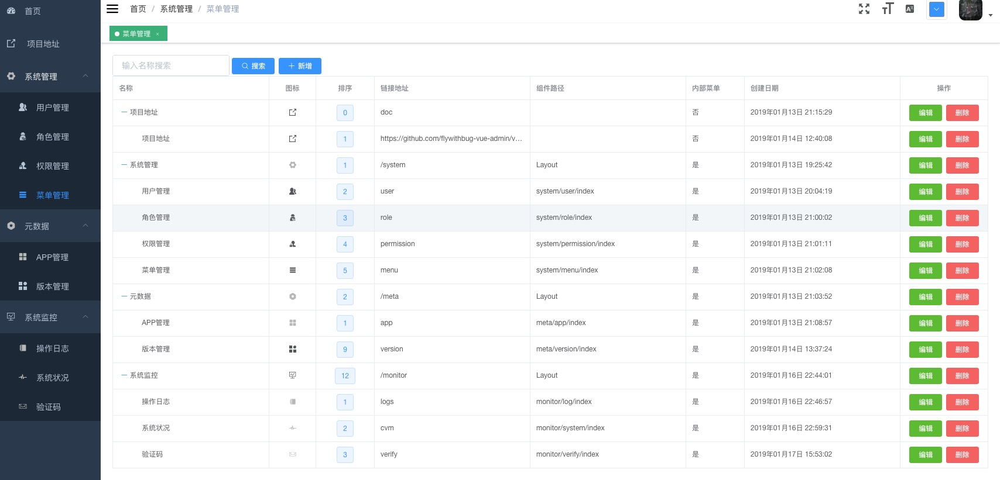

## 简介


[在线访问](https://www.flywithme.top)

[后端源码地址](https://github.com/flywithbug-vue-admin/go-eladmin)

前端使用Vue + element-ui

  
- **主要框架**   
 ``` 
  vue-router
  vuex
  axios
  vue-i18n
  element-ui
 ```

``` bash
# install dependencies
npm install

# serve with hot reload at localhost:8080
npm run dev

# build for production with minification
npm run build

# build for production and view the bundle analyzer report
npm run build --report
```

-------------------------------
## 功能说明 (vue & go)
- [x] 登录 / 注销

- [x] 权限验证
  - [x] 页面权限  

- [x] 全局功能
  - [x] 国际化多语言
  - [x] 动态侧边栏（支持多级路由嵌套）
  - [x] 快捷导航(标签页)
  - [x] ScreenFull全屏
  - [x] 自适应收缩侧边栏


- [x] 系统管理
  - [x] 用户管理
  - [x] 角色管理
  - [x] 权限管理
  - [x] 菜单管理
  
- [x] 元数据 
  - [x] 应用管理
    - [x] 管理员权限
    - [x] 修改权限
  - [x] 版本管理
  
- [ ] 系统监控
  - [x] 操作日志
  - [x] 验证码
  - [ ] 服务器监控
  
  
- [ ] 开发工具
  - [ ] 数据模型 
  - [ ] API管理
  
  
### 页面示例
   


####  项目结构

``` 
.
├── LICENSE
├── README.md
├── Tree.md
├── build
│   ├── build.js
│   ├── check-versions.js
│   ├── logo.png
│   ├── utils.js
│   ├── vue-loader.conf.js
│   ├── webpack.base.conf.js
│   ├── webpack.dev.conf.js
│   └── webpack.prod.conf.js
├── config
│   ├── dev.env.js
│   ├── index.js
│   ├── prod.env.js
│   └── sit.env.js
├── favicon.ico
├── index.html
├── package-lock.json
├── package.json
├── src
│   ├── App.vue
│   ├── api
│   │   ├── app.js
│   │   └── user.js
│   ├── assets
│   │   ├── 401_images
│   │   │   └── 401.gif
│   │   ├── 404_images
│   │   │   ├── 404.png
│   │   │   └── 404_cloud.png
│   │   ├── custom-theme
│   │   │   ├── fonts
│   │   │   │   ├── element-icons.ttf
│   │   │   │   └── element-icons.woff
│   │   │   └── index.css
│   │   ├── image_placeholder.png
│   │   └── logo.png
│   ├── components
│   │   ├── Breadcrumb
│   │   │   └── index.vue
│   │   ├── ErrorLog
│   │   │   └── index.vue
│   │   ├── FixedButton
│   │   │   └── index.vue
│   │   ├── Hamburger
│   │   │   └── index.vue
│   │   ├── HelloWorld.vue
│   │   ├── LangSelect
│   │   │   └── index.vue
│   │   ├── Pagination
│   │   │   └── index.vue
│   │   ├── Screenfull
│   │   │   └── index.vue
│   │   ├── ScrollPane
│   │   │   └── index.vue
│   │   ├── Share
│   │   │   └── dropdownMenu.vue
│   │   ├── SizeSelect
│   │   │   └── index.vue
│   │   ├── SvgIcon
│   │   │   └── index.vue
│   │   └── ThemePicker
│   │       └── index.vue
│   ├── config
│   │   └── index.js
│   ├── directive
│   │   ├── clipboard
│   │   │   ├── clipboard.js
│   │   │   └── index.js
│   │   ├── el-dragDialog
│   │   │   ├── drag.js
│   │   │   └── index.js
│   │   ├── permission
│   │   │   ├── index.js
│   │   │   └── permission.js
│   │   ├── sticky.js
│   │   └── waves
│   │       ├── index.js
│   │       ├── waves.css
│   │       └── waves.js
│   ├── errorLog.js
│   ├── filters
│   │   └── index.js
│   ├── icons
│   │   ├── index.js
│   │   ├── svg
│   │   └── svgo.yml
│   ├── lang
│   │   ├── en.js
│   │   ├── index.js
│   │   └── zh.js
│   ├── main.js
│   ├── permission.js
│   ├── router
│   │   ├── index.js
│   │   └── modules
│   │       └── metadata.js
│   ├── store
│   │   ├── getters.js
│   │   ├── index.js
│   │   └── modules
│   │       ├── app.js
│   │       ├── errorLog.js
│   │       ├── permission.js
│   │       ├── tagsView.js
│   │       └── user.js
│   ├── styles
│   │   ├── btn.scss
│   │   ├── element-ui.scss
│   │   ├── index.scss
│   │   ├── mixin.scss
│   │   ├── sidebar.scss
│   │   ├── transition.scss
│   │   └── variables.scss
│   ├── utils
│   │   ├── auth.js
│   │   ├── clipboard.js
│   │   ├── createUniqueString.js
│   │   ├── date.js
│   │   ├── fetch
│   │   │   └── index.js
│   │   ├── i18n.js
│   │   ├── index.js
│   │   ├── openWindow.js
│   │   ├── permission.js
│   │   ├── scrollTo.js
│   │   └── validate.js
│   └── views
│       ├── application
│       │   ├── app.vue
│       │   └── version.vue
│       ├── dashboard
│       │   └── index.vue
│       ├── documentation
│       │   └── index.vue
│       ├── errorPage
│       │   ├── 401.vue
│       │   └── 404.vue
│       ├── layout
│       │   ├── Layout.vue
│       │   ├── components
│       │   │   ├── AppMain.vue
│       │   │   ├── Navbar.vue
│       │   │   ├── Sidebar
│       │   │   ├── TagsView.vue
│       │   │   └── index.js
│       │   └── mixin
│       │       └── ResizeHandler.js
│       ├── login
│       │   ├── authredirect.vue
│       │   └── index.vue
│       ├── redirect
│       │   └── index.vue
│       ├── svg-icons
│       │   ├── index.vue
│       │   └── requireIcons.js
│       └── user
│           └── user.vue
└── static
    └── tinymce4.7.5
        ├── langs
        │   └── zh_CN.js
        ├── plugins
        │   ├── codesample
        │   │   └── css
        │   ├── emoticons
        │   │   └── img
        │   └── visualblocks
        │       └── css
        ├── skins
        │   └── lightgray
        │       ├── content.inline.min.css
        │       ├── content.min.css
        │       ├── fonts
        │       ├── img
        │       ├── skin.min.css
        │       └── skin.min.css.map
        └── tinymce.min.js

80 directories, 187 files

```

使用PanJiaChen的:[vue-element-admin](https://github.com/PanJiaChen/vue-element-admin/blob/master/README.zh-CN.md)搭好的基础框架
借鉴[elunez](https://github.com/elunez/eladmin)页面